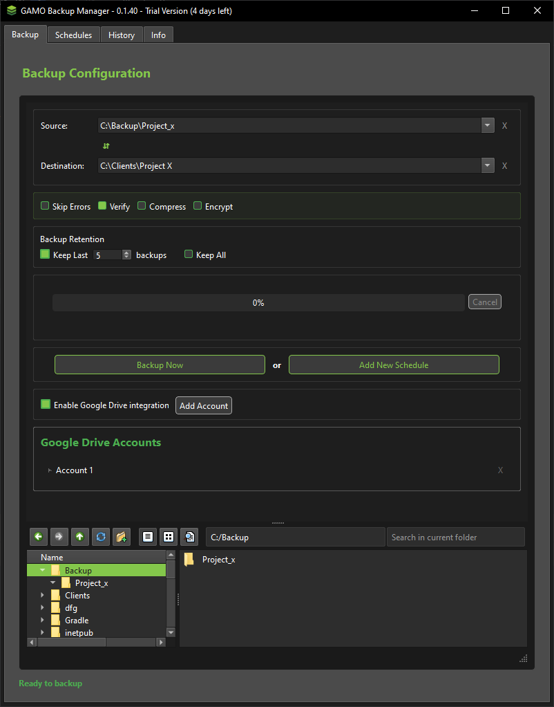
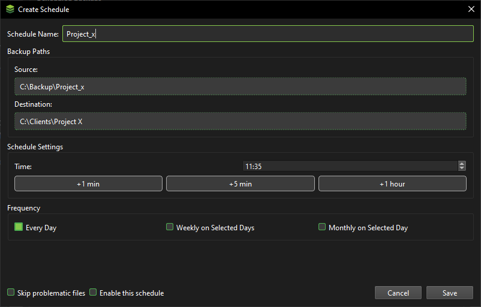
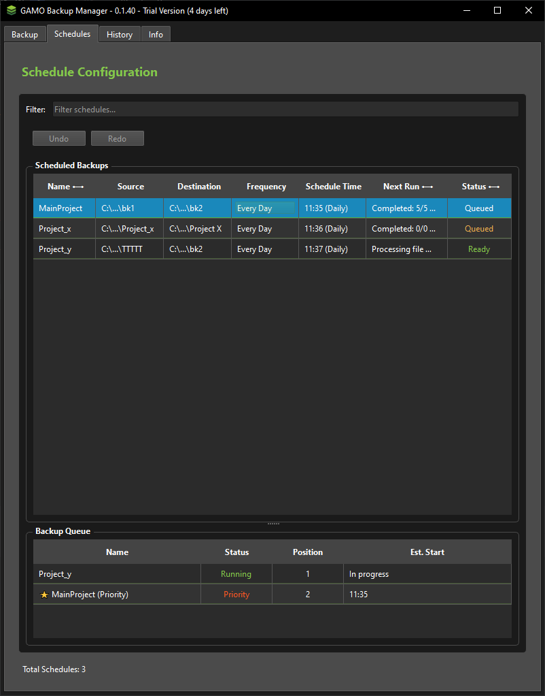
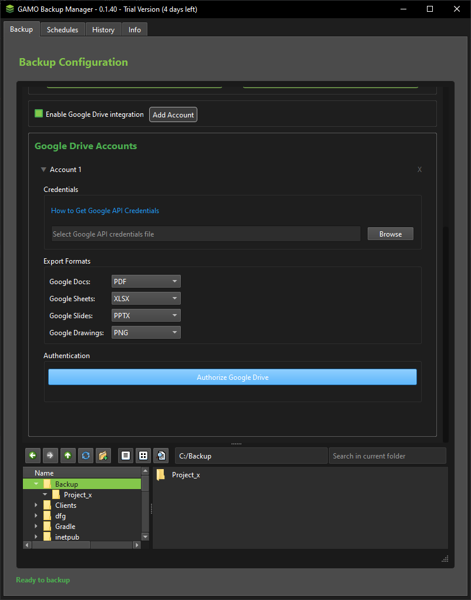

# GAMO Backup Manager

## 🚀 Project Overview
A robust, cross-platform backup management solution designed to provide secure, flexible, and intelligent data backup capabilities.

## 🌟 Key Features

### 🔒 Advanced Security
- AES-256 file encryption file encryption
- Secure cloud storage integration
- Unique license management system

### ☁️ Cloud Integration
- Seamless Google Drive backup
- OAuth 2.0 authentication
- Flexible cloud storage options

### ⏰ Smart Scheduling
- Customizable backup schedules
- Multiple frequency options
- Intelligent backup tracking

## 🛠 Technical Highlights

### Technologies
- **Language**: Python 3.13
- **GUI**: PyQt6
- **Cloud**: 
  - Google Drive API
  -  Firebase Firestore: Used for managing user licensing (trial, basic, pro)
- **Key Libraries**: 
  - Cryptography
  - Firebase Admin SDK

### Architecture
- Modular design
- Event-driven architecture

## 🖥 Screenshots

### Backup Configuration

Tailor your backup process to your exact needs with the following configuration options:

Source and Destination Selection:

Simply drag and drop folders from your file explorer directly into the "Source" and "Destination" fields.
The system will validate the paths to ensure they are accessible and valid.

### Advanced Backup Options:
- Skip errors: Configure rules to exclude specific files or file types from your backup.
- Checksum Verification: Enable checksums to ensure data integrity during the backup process. This verifies that your backed-up files are identical to the original source files.
- Compression: Reduce the size of your backup files with compression, saving storage space.
- Encryption: Protect your sensitive data with strong encryption, ensuring that only authorized users can access your backups.

### Google Drive Integration:
- Connect your Google Drive account to seamlessly back up your data to the cloud.
- Easily authenticate and select folders within google drive as a source or destination.

### Backup Scheduling and Execution:
- Backup Now: Initiate an immediate backup with the current configuration.
- Create New Schedule: Set up a recurring backup schedule with customizable frequency (daily, weekly, monthly) and time.

### Schedule Configuration

### Create New Schedule:
- Schedule Name: Enter a unique identifier for this backup schedule. The system will ensure that schedule names are unique.
- Frequency: Select the backup frequency: daily, weekly, or monthly.
- Enable on Save: Check this option to activate the schedule immediately upon saving, or leave it unchecked to enable it manually later.

### Schedule Management

### Seamlessly manage schedules:
- Schedule Activation: Enable or disable scheduled backups with a simple toggle.
- Immediate Execution: "Run Now" allows you to instantly trigger a scheduled backup, regardless of its scheduled time.
- Schedule Editing: "Edit" provides access to modify all settings of an existing schedule, including name, frequency, and options.
- Schedule Removal: "Delete" permanently removes a selected backup schedule.

### Google Drive Integration

### Seamlessly integrate Google Drive for cloud backups with two authorization options:
### Easy 
- Simple Authorization (Preconfigured Widget):
- Connect your Google Drive account with a simple, preconfigured authorization widget.
- Ideal for users who want a quick and easy setup.
- Limited to connecting a maximum of two Google Drive preconfigured accounts.

### Power
- Advanced Authorization (Custom API Credentials):
- Use your own Google Drive API credentials for full control and flexibility.
- Allows for unlimited Google Drive account integration.
- Suitable for users who require advanced features or have specific authorization needs.

## 🚀 Installation and Usage
1.  Download the GAMO Backup Manager executable from [[Your Download Link](https://drive.google.com/drive/folders/1mDjHMLS9J6eKggo8z3kfggRr31gpEIIu?usp=sharing)].
4.  Launch the GAMO Backup Manager application.
5.  Configure your backup settings and schedules.
